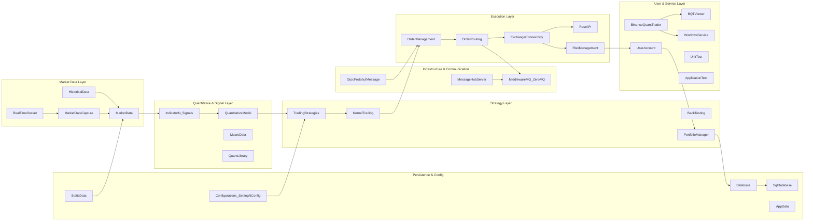

# Binance Quant Trader Project
## Comprehensive System Documentation

---

### 🧭 Overview

**Binance Quant Trader (BQT)** is a high-performance, multi-threaded **real-time trading system** designed for **automated trading on Binance Futures and Spot markets**.  
It supports both **live execution** and **backtesting**, with modular architecture for scalability and maintainability.

The system ingests live market data, analyzes quantitative signals, and executes orders through Binance REST and WebSocket APIs.  
All core components are written in **modern C++17/20**, following RAII principles, thread safety, and asynchronous event-driven design.

---

## 1. System Architecture

### 1.1 Architecture Overview

The system is composed of multiple interacting subsystems.  
Each subsystem operates as a module, connected via **ZeroMQ** (internal messaging) and **gRPC** (external status/control).

**Main Data Flow:**

```
RealTimeSocket → MarketData → IndicatorNSignals → QuantitativeModel
     ↓
TradingStrategies → OrderManagement → OrderRouting
     ↓
ExchangeConnectivity (REST/Socket) → Binance
     ↓
UserAccount → PortfolioManager → Database
```

---

### 1.2 Mermaid System Flowchart



---

## 2. Module Responsibilities

| Module | Description |
|---------|--------------|
| **AppData** | Handles local storage, logs, and runtime configuration caches. |
| **ApplicationTest / UnitTest** | Test harness for integration and functional validation. |
| **BackTesting** | Historical simulation engine for strategy performance evaluation. |
| **BinanceQuantTrader** | Main executable entry point; system bootstrapper. |
| **BQTViewer** | GUI or visualization client for monitoring strategy behavior. |
| **ComplianceNRegulatory** | Trade rule validation and exchange compliance layer. |
| **Configurations / SettingNConfig** | Loads system and strategy-level configurations (JSON/YAML). |
| **CurlAPI** | Base HTTP client wrapper around libcurl for REST calls. |
| **Database / SqlDatabase** | Trade and market data persistence layer (SQLite / MySQL). |
| **ExchangeConnectivity** | Manages WebSocket and REST API connectivity to Binance. |
| **ExchangeSimulator** | Simulated exchange for offline testing and replay. |
| **GrpcProtobufMessage** | Defines protobuf contracts for gRPC interfaces. |
| **HistoricalData** | Provides past market data for backtesting. |
| **IndicatorNSignals** | Generates signals and indicators (EMA, RSI, VWAP, etc.). |
| **KernelTrading** | Central orchestrator managing strategy lifecycle and threads. |
| **LibraryUtils** | Shared utility components (time, logging, threading, alarms). |
| **MacroData** | Handles global economic data for macro-driven strategies. |
| **MarketData / MarketDataCapture** | Real-time feed handler; captures order books, trades, and tickers. |
| **MessageHubServer** | Internal publish/subscribe server based on ZeroMQ. |
| **MiddlewareMQ** | Asynchronous message queue connecting components. |
| **OrderManagement** | Constructs and validates trade orders. |
| **OrderRouting** | Routes validated orders to appropriate exchange endpoints. |
| **PortfolioManager** | Maintains account positions, PnL, and margin calculations. |
| **PythonPlugin** | Provides Python-based extensions or strategy scripting. |
| **QuantitativeModel / QuantLibrary** | Core quantitative logic, signal scoring, and modeling. |
| **RealTimeSocket** | WebSocket client for Binance streams (ticker, trades, orderbook). |
| **RestAPI** | REST-based trade and account operations. |
| **RiskManagement** | Enforces per-symbol and per-account risk limits. |
| **StaticData** | Loads instrument metadata (symbols, tick sizes, leverage). |
| **TradingStrategies** | Strategy layer (e.g., SmartLongShort, MeanReversion, VWAP). |
| **UserAccount** | Trade user profile, balance tracking, and credential management. |
| **WindowsService** | Windows service runner for 24/7 deployment. |

---

## 3. Data Flow & Threading Model

### 3.1 Real-Time Flow
1. **RealTimeSocket** subscribes to Binance WebSocket feeds (tickers, trades, depth).  
2. **MarketData** aggregates and publishes updates to **IndicatorNSignals**.  
3. **IndicatorNSignals / QuantitativeModel** compute signals and models.  
4. **TradingStrategies** (e.g. SmartLongShort) generate trade intentions.  
5. **OrderManagement** builds and validates orders.  
6. **OrderRouting** dispatches through **ZeroMQ → ExchangeConnectivity → REST API**.  
7. **UserAccount** and **PortfolioManager** update account state.  
8. **Database** stores execution and market data.

### 3.2 Concurrency Model
- Each major subsystem (MarketData, Strategy, Order, Portfolio) runs on its **own thread**.  
- **ZeroMQ** ensures thread-safe message passing.  
- **Mutexes** and **condition variables** used for local synchronization.  
- **gRPC server** handles external control requests (order status, strategy parameters).  

---

## 4. Technology Stack

| Layer | Technology |
|-------|-------------|
| Programming Language | C++17 / C++20 |
| Messaging | ZeroMQ (internal) |
| RPC Interface | gRPC / Protobuf |
| HTTP/REST | libcurl |
| Database | SQLite / MySQL |
| Build System | CMake |
| Unit Testing | GoogleTest |
| Platform | Windows / Linux (service mode supported) |

---

## 5. Coding Style & Conventions

The system adheres to the **Binance Quant Trader C++ Coding Style Guide** (see `CodingStyleGuide.md`).  
Key highlights:

- Member variables use prefix `m_`.  
- Classes and methods in `PascalCase`.  
- Thread safety enforced via RAII.  
- Namespace-based modularity (e.g., `MarketData::RealTimeMarketData`).  
- Doxygen-based documentation for every class and public API.  

Example snippet:
```cpp
class SmartLongShortStrategy :
    public TradingStrategyBase,
    public MarketData::MarketDataObserver
{
public:
    explicit SmartLongShortStrategy(const std::string& cfgPath,
                                    MarketData::RealTimeMarketData* marketData,
                                    UserAccount::Trader* trader,
                                    ComplianceNRegulatory::BinanceTradingRules* rules);

    void StartLive() override;
    void StopLive() override;

private:
    std::vector<std::string> m_targetSymbols;
    std::unique_ptr<QuantitativeModel::MarketDataAnalyzer> m_analyzer;
};
```

---

## 6. Folder Structure (Suggested)

```
/src
 ├── AppData/
 ├── ApplicationTest/
 ├── BackTesting/
 ├── BinanceQuantTrader/
 ├── BQTViewer/
 ├── ComplianceNRegulatory/
 ├── Configurations/
 ├── Database/
 ├── ExchangeConnectivity/
 ├── GrpcProtobufMessage/
 ├── IndicatorNSignals/
 ├── KernelTrading/
 ├── MarketData/
 ├── MessageHubServer/
 ├── MiddlewareMQ/
 ├── OrderManagement/
 ├── OrderRouting/
 ├── PortfolioManager/
 ├── QuantitativeModel/
 ├── RiskManagement/
 ├── TradingStrategies/
 ├── UserAccount/
 ├── WindowsService/
 ├── tests/
 └── docs/
      ├── CodingStyleGuide.md
      └── ProjectDocumentation.md
```

---

## 7. Summary

✅ Modular, multi-threaded architecture  
✅ Real-time and backtesting unified pipeline  
✅ gRPC external control & ZeroMQ internal bus  
✅ REST/WebSocket connectivity to Binance  
✅ Extensible quantitative model layer  
✅ Clean coding style and documentation consistency  

> **Binance Quant Trader** is engineered for robust, extensible, and maintainable quantitative trading at institutional quality.

---
